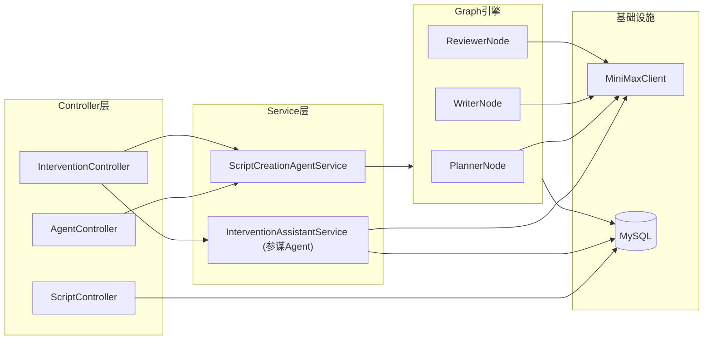
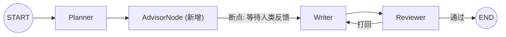
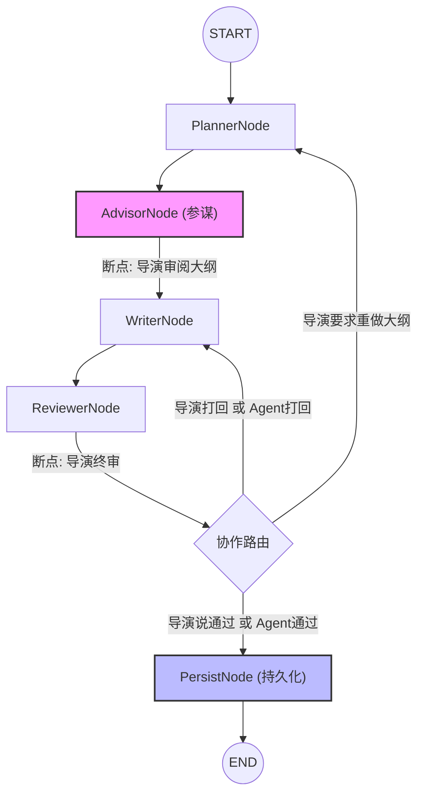

# 🏗️ Agent Pipeline 架构审查与优化建议报告

**审查人**：架构师视角  
**审查日期**：2026-04-29  
**审查范围**：全量工程代码（19 个源文件 + 配置）

---

## 一、 当前架构总览



---

## 二、 核心问题诊断（按严重程度排序）

### 🔴 P0 - 架构设计缺陷

#### 问题 1：参谋 Agent 游离于图引擎之外

**现状**：`InterventionAssistantService`（参谋 Agent）是一个普通的 Spring Service，在 `ScriptCreationAgentService.createScriptBlocking()` 中被硬编码调用。它**不是**图中的节点。

**为什么这是个问题**：
- 参谋 Agent 的执行**不受图引擎管控**，不会被 checkpoint 记录，无法回溯。
- 它的输出（advice）直接写入了 MySQL 的 `interventions` 表，但**没有回写到 Graph State**，导致 Writer 节点根本无法读取参谋的建议。
- 如果参谋 Agent 调用 MiniMax 超时或失败，**不会触发图引擎的重试或错误处理机制**。

**修复建议**：将参谋 Agent 提升为图中的正式节点 `AdvisorNode`，放置在 `planner` 与 `writer` 之间。当断点触发时，`AdvisorNode` 负责生成建议并将其写入 State，然后人类可以在此断点注入反馈。



---

#### 问题 2：路由逻辑中的"幽灵反馈"Bug

**现状**：`ScriptGraphConfig` 中的路由 Lambda 每次都从 State 中读取 `KEY_HUMAN_INTERVENTION`。

**为什么这是个问题**：
- 人类反馈一旦写入 State，**永远不会被清除**。
- 当 Reviewer 打回剧本给 Writer 重写后，Writer 再次流转到 Reviewer 时，路由 Lambda 还会读到**上一次**的人类反馈。
- 如果上一次反馈包含"重做"，即使 Reviewer 说"通过"了，路由也会错误地打回。

**修复建议**：在每次路由判断执行后，或在节点入口处，主动清除 `KEY_HUMAN_INTERVENTION`，避免历史反馈"幽灵般"地影响后续决策。

---

### 🟡 P1 - 职责边界模糊

#### 问题 3：`ScriptCreationAgentService` 职责过重

**现状**：这个 Service 同时承担了：
1. 构建图输入参数
2. 启动图执行
3. 检测中断
4. 触发参谋 Agent
5. 恢复执行（Resume）
6. 解析 `executionId` 中的 `threadId:checkpointId`

**为什么这是个问题**：
- 职责过多违反了**单一职责原则 (SRP)**。
- `executionId` 字段中用冒号拼接 `threadId` 和 `checkpointId` 是一种脆弱的编码方式（L96-98），容易因为 ID 本身包含冒号而解析错误。

**修复建议**：
- 拆分为 `GraphExecutionService`（负责启动/恢复图执行）和 `InterruptionHandler`（负责中断检测和参谋调度）。
- `InterventionEntity` 增加独立的 `threadId` 和 `checkpointId` 字段，废弃冒号拼接。

---

#### 问题 4：`MiniMaxClient` 缺乏抽象

**现状**：`MiniMaxClient` 是一个具体类（`@Component`），所有节点直接依赖它。`MockMiniMaxClient` 通过继承 + 注释 `@Primary` 来切换。

**为什么这是个问题**：
- 切换真实/Mock 模式需要修改源码（注释/反注释 `@Primary`），这在 CI/CD 环境中是不可接受的。
- 没有接口抽象，无法在不修改代码的情况下替换为其他 LLM（如 Claude、GPT）。

**修复建议**：
```java
// 抽取接口
public interface LlmClient {
    String chat(String prompt);
}

// 通过 Spring Profile 切换实现
@Component
@Profile("!mock")
public class MiniMaxClient implements LlmClient { ... }

@Component
@Profile("mock")
public class MockMiniMaxClient implements LlmClient { ... }
```
启动时通过 `spring.profiles.active=mock` 即可无代码切换。

---

### 🟢 P2 - 代码质量与可维护性

#### 问题 5：API Key 硬编码在配置文件中

**现状**：`application.yml` 中 `minimax.api-key` 是明文的完整 API Key。

**修复建议**：使用环境变量注入：
```yaml
minimax:
  api-key: ${MINIMAX_API_KEY:}
```

#### 问题 6：`InterventionController` 中 `ObjectMapper` 手动实例化

**现状**：`private final ObjectMapper objectMapper = new ObjectMapper();`（L37）

**修复建议**：应通过构造函数注入 Spring 容器管理的 `ObjectMapper`，以确保与全局 Jackson 配置（如日期格式、NULL 处理）一致。

#### 问题 7：未使用的代码残留

**现状**：
- `ScriptGraphConfig.java` L7：`import NodeOutput` 未使用
- `InterventionController.java` L6：`import NodeOutput` 未使用
- `InterventionAssistantService.java` L64：`findRealIdsByGraphId()` 方法从未被调用

**修复建议**：直接删除，保持代码整洁。

#### 问题 8：`ScriptController` 与工作流脱节

**现状**：`ScriptController` 提供了分页查询、详情、点赞等 CRUD 接口，但**工作流中没有任何地方会将生成的剧本写入 `script_entity` 表**。这些接口实际上是空壳。

**修复建议**：在 Writer 或 Reviewer 节点执行完成后，增加一个持久化步骤，将 `KEY_SCRIPT` 写入 `script_entity` 表，使 `ScriptController` 的接口真正可用。

#### 问题 9：`tokens_to_generate` 硬编码为 1024

**现状**：`MiniMaxClient.java` L51 中 `requestBody.put("tokens_to_generate", 1024);`

**修复建议**：对于需要生成万字剧本的 Writer 节点，1024 tokens 远远不够（实际测试中 Writer 消耗了 8060 tokens）。应该将此参数外部化配置，或由各节点按需传入。

---

## 三、 推荐的目标架构



### 改进点总结：
1. **参谋提升为正式节点**：纳入图引擎管控，享受 checkpoint 保护。
2. **新增 PersistNode**：在审核通过后，将最终剧本写入 `script_entity` 表，打通 CRUD 接口。
3. **LlmClient 接口化**：支持多模型热切换。
4. **反馈清除机制**：每轮循环开始时清除上一轮的人类指令，防止"幽灵反馈"。

---

## 四、 优化优先级排序

| 优先级 | 问题 | 影响面 | 改动量 |
|---|---|---|---|
| **P0** | 参谋 Agent 提升为图节点 | 架构完整性 | 中 |
| **P0** | 路由中"幽灵反馈" Bug | 逻辑正确性 | 小 |
| **P1** | Service 职责拆分 | 可维护性 | 中 |
| **P1** | LlmClient 接口化 + Profile | 可扩展性 | 小 |
| **P2** | API Key 环境变量化 | 安全性 | 极小 |
| **P2** | ObjectMapper 注入 | 一致性 | 极小 |
| **P2** | 未使用代码清理 | 整洁度 | 极小 |
| **P2** | ScriptController 打通 | 功能完整性 | 中 |
| **P2** | tokens 参数外部化 | 灵活性 | 小 |
